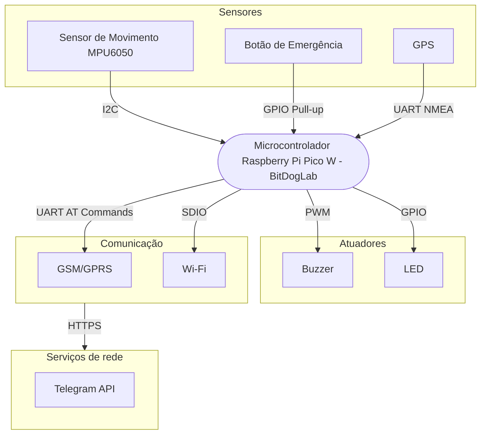

```mermaid
graph TD
    %% Bloco principal
    MCU([Microcontrolador Raspberry Pi Pico W - BitDogLab])

    %% Sensores
    subgraph SENSORES[Sensores]
        MOV[Sensor de Movimento MPU6050]
        BTN[Botão de Emergência]
        GPS[GPS]
    end

    %% Atuadores
    subgraph ATUADORES[Atuadores]
        BUZZER[Buzzer]
        LED[LED]
    end

    %% Comunicação
    subgraph COM[Comunicação]
        GSM[GSM/GPRS]
        WIFI[Wi-Fi]
    end

    %% Serviços de rede
    subgraph NET[Serviços de rede]
        TELEGRAM[Telegram API]
    end

    %% Ligações sensores -> MCU
    MOV -- "I2C" --> MCU
    BTN -- "GPIO Pull-up" --> MCU
    GPS -- "UART NMEA" --> MCU
    

    %% Ligações MCU -> atores
    MCU -- "PWM" --> BUZZER
    MCU -- "GPIO" --> LED
    MCU -- "UART AT Commands" --> GSM
    MCU -- "SDIO"--> WIFI

    %% Ligação módulo de rede -> Telegram
    COM -- "HTTPS" --> NET

```