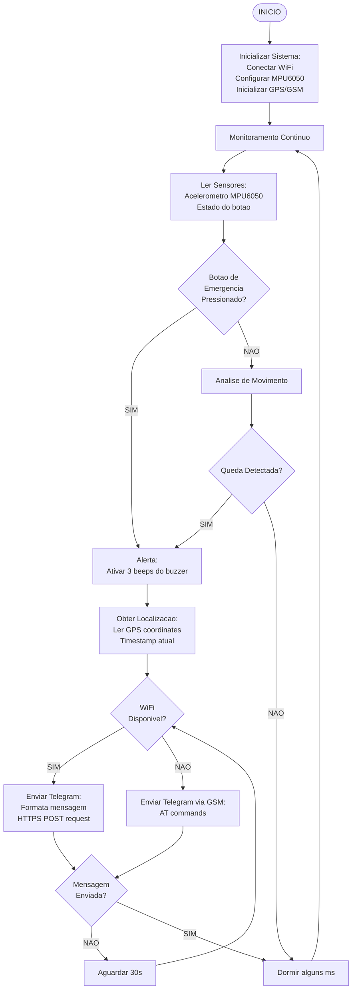

```mermaid

flowchart TD
    START([INICIO]) --> INIT[Inicializar Sistema:<br/>Conectar WiFi<br/>Configurar MPU6050<br/>Inicializar GPS/GSM]
    
    INIT --> MAIN_LOOP[Monitoramento Continuo]
    
    MAIN_LOOP --> READ_SENSORS[Ler Sensores:<br/>Acelerometro MPU6050<br/>Estado do botao]
    
    READ_SENSORS --> BTN_CHECK{Botao de<br/>Emergencia<br/>Pressionado?}
    
    BTN_CHECK -->|SIM| BEEP_ALERT[Alerta:<br/>Ativar 3 beeps do buzzer]
    
    BTN_CHECK -->|NAO| FALL_ANALYSIS[Analise de Movimento]
    
    FALL_ANALYSIS --> FALL_CHECK{Queda Detectada?}
    
    FALL_CHECK -->|SIM| BEEP_ALERT
    
    FALL_CHECK -->|NAO| SLEEP[Dormir alguns ms]
    
    BEEP_ALERT --> GET_LOCATION[Obter Localizacao:<br/>Ler GPS coordinates<br/>Timestamp atual]
    
    GET_LOCATION --> WIFI_CHECK{WiFi<br/>Disponivel?}
    
    WIFI_CHECK -->|SIM| SEND_TELEGRAM[Enviar Telegram:<br/>Formata mensagem<br/>HTTPS POST request]
    
    WIFI_CHECK -->|NAO| SEND_GSM[Enviar Telegram via GSM: <br/>AT commands]
    
    SEND_TELEGRAM --> MSG_CHECK{Mensagem<br/>Enviada?}
    SEND_GSM --> MSG_CHECK
    
    MSG_CHECK -->|NAO| RETRY_WAIT[Aguardar 30s]
    MSG_CHECK -->|SIM| SLEEP
    
    RETRY_WAIT --> WIFI_CHECK
    
    SLEEP --> MAIN_LOOP


```